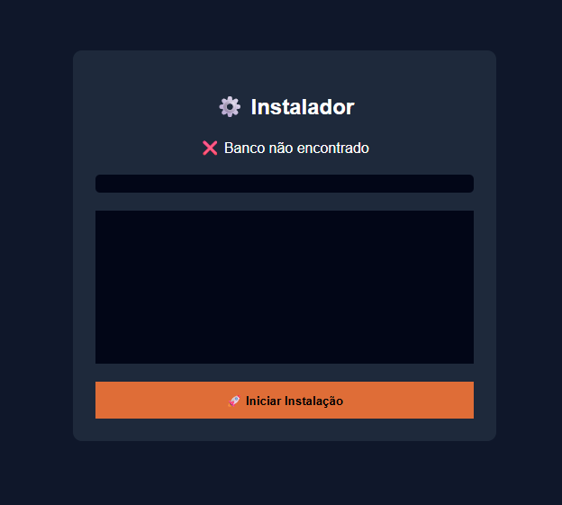

<h1>📅 Agenda Financeira</h1>

<strong>Sistema de Agendamento e Controle Financeiro</strong> 
Desenvolvido em PHP, MySQL, HTML, CSS, JavaScript e jQuery

<h2>🚀 Sobre o Projeto</h2>

A Agenda Financeira é um sistema desenvolvido para empresas que trabalham com agendamentos de serviços em múltiplas pistas ou setores.

O projeto foi baseado no repositório:

<pre>
diversos_php/agenda_modelo04
</pre>

Além do gerenciamento de agendamentos, o sistema possui integração automática com o módulo financeiro, permitindo o controle completo das receitas e despesas da empresa.

<h2>✨ Principais Funcionalidades</h2>

<table>
<tr>
<th>Funcionalidade</th>
<th>Descrição</th>
</tr>

<tr>
<td>📅 Agenda</td>
<td>Controle completo de horários e agendamentos.</td>
</tr>

<tr>
<td>🛣️ Pistas</td>
<td>Cadastro de múltiplas pistas de atendimento.</td>
</tr>

<tr>
<td>🧰 Serviços</td>
<td>Cadastro de serviços com duração e cor personalizada.</td>
</tr>

<tr>
<td>👥 Clientes</td>
<td>Cadastro e gerenciamento de clientes.</td>
</tr>

<tr>
<td>💰 Financeiro</td>
<td>Geração automática de entradas financeiras.</td>
</tr>

<tr>
<td>📄 Relatórios</td>
<td>Exportação das movimentações em PDF.</td>
</tr>

</table>

<h2>📅 Agenda de Serviços</h2>

<ul>
<li>Cadastro de múltiplas pistas.</li>
<li>Cadastro ilimitado de serviços.</li>
<li>Duração personalizada por serviço.</li>
<li>Cor personalizada para cada serviço.</li>
<li>Visualização colorida na agenda.</li>
<li>Controle de ocupação por horário.</li>
</ul>

<h2>👥 Cadastro de Clientes</h2>

<ul>
<li>Cadastro completo de clientes.</li>
<li>Vinculação aos agendamentos.</li>
<li>Histórico de atendimentos.</li>
</ul>

<h2>💰 Controle Financeiro Automático</h2>

Ao marcar um agendamento como <strong>Pago</strong>, o sistema gera automaticamente uma entrada financeira.

Essa movimentação fica registrada na tabela financeira e pode ser consultada posteriormente no módulo de movimentações.

<h2>📝 Lançamentos Manuais</h2>

O sistema também permite registrar movimentações financeiras manualmente:

<ul>
<li>➕ Entradas</li>
<li>➖ Saídas</li>
<li>📊 Controle de caixa</li>
</ul>

<h2>📊 Movimentações Financeiras</h2>

<table>
<tr>
<th>Tipo</th>
<th>Origem</th>
</tr>

<tr>
<td>Entrada Automática</td>
<td>Agendamentos pagos</td>
</tr>

<tr>
<td>Entrada Manual</td>
<td>Lançamento manual</td>
</tr>

<tr>
<td>Saída Manual</td>
<td>Lançamento manual</td>
</tr>

</table>

<h2>📄 Relatórios PDF</h2>

Geração de relatórios financeiros contendo:

<ul>
<li>Entradas</li>
<li>Saídas</li>
<li>Movimentações</li>
<li>Fluxo de caixa</li>
</ul>

<h2>🔄 Fluxo de Funcionamento</h2>

<pre>
Cadastro de Cliente
        ↓
Cadastro de Serviço
        ↓
Agendamento
        ↓
Pagamento
        ↓
Entrada Financeira
        ↓
Movimentações
        ↓
Relatório PDF
</pre>

<h2>🛠️ Tecnologias Utilizadas</h2>

<table>
<tr>
<th>Camada</th>
<th>Tecnologia</th>
</tr>

<tr>
<td>Backend</td>
<td>PHP</td>
</tr>

<tr>
<td>Banco de Dados</td>
<td>MySQL</td>
</tr>

<tr>
<td>Frontend</td>
<td>HTML5, CSS3, JavaScript e jQuery</td>
</tr>

</table>

<h2>📸 Instalação</h2>

   
Para instalar o sistema acesse a url: 'AgendaFinanceira/install/index.php' e o sistema vai instalar o banco, baseado nos arquivos da pasta banco

<h2>🎯 Objetivo</h2>

Centralizar em uma única plataforma o gerenciamento operacional e financeiro da empresa, permitindo controlar:

<ul>
<li>Agendamentos</li>
<li>Clientes</li>
<li>Serviços</li>
<li>Receitas</li>
<li>Despesas</li>
<li>Relatórios</li>
</ul>

<h3>Desenvolvido em PHP ❤️</h3>

