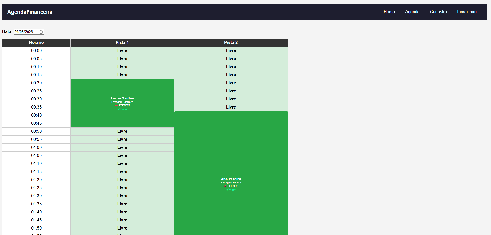
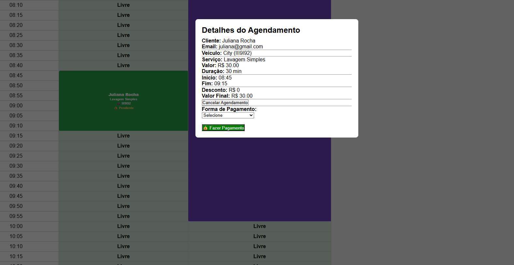
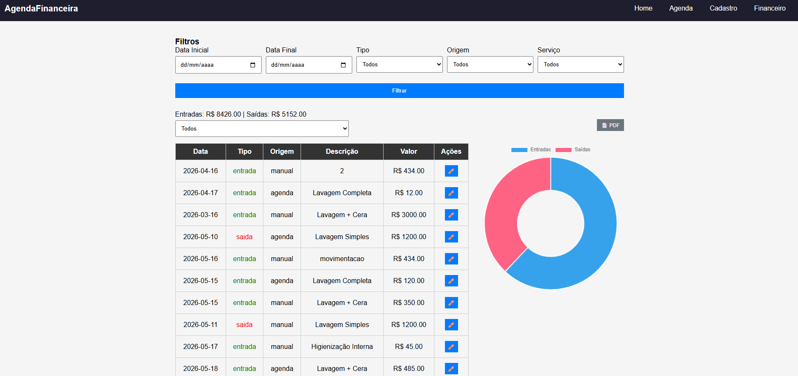
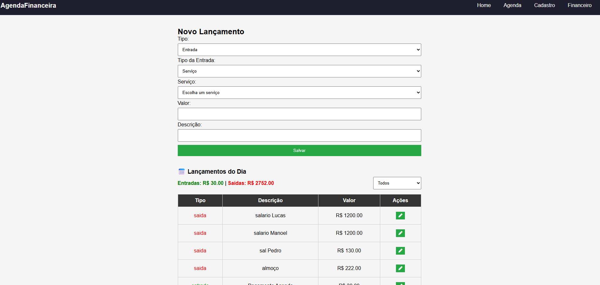

\# Agenda Financeira

Sistema de agendamento e controle financeiro desenvolvido em \*\*PHP, HTML, CSS, JavaScript e jQuery\*\*, voltado para empresas que trabalham com agendamentos de serviços em múltiplas pistas ou setores.

\## Sobre o Projeto

O projeto foi desenvolvido com base no repositório:

`diversos\_php/agenda\_modelo04`

A aplicação permite gerenciar agendamentos de forma prática, associando serviços, clientes e movimentações financeiras em um único sistema.

\## Principais Funcionalidades

\### 📅 Agenda de Serviços

\* Cadastro de múltiplas pistas.

\* Cadastro de diversos serviços.

\* Definição de duração específica para cada serviço.

\* Definição de cor personalizada para cada serviço.

\* Visualização dos serviços na agenda utilizando as cores cadastradas.

\* Controle de horários e ocupação das pistas.

\### 👥 Cadastro de Clientes

\* Cadastro completo de clientes.

\* Associação de clientes aos agendamentos.

\* Histórico de atendimentos.

\### 💰 Controle Financeiro Automático

Quando um serviço agendado é marcado como \*\*Pago\*\*, o sistema cria automaticamente um lançamento de entrada financeira.

Esse lançamento é registrado na tabela financeira e pode ser consultado posteriormente no módulo de movimentações.

\### 📝 Lançamentos Manuais

Além dos lançamentos automáticos gerados pelos agendamentos, o sistema possui um módulo para:

\* Cadastro manual de entradas.

\* Cadastro manual de saídas.

\* Controle financeiro completo.

\### 📊 Movimentações Financeiras

No menu \*\*Movimentações\*\* é possível visualizar:

\* Entradas geradas automaticamente pelos serviços pagos.

\* Entradas cadastradas manualmente.

\* Saídas cadastradas manualmente.

\* Histórico completo das movimentações financeiras.

\### 📄 Relatórios PDF

O sistema permite gerar relatórios em PDF contendo as movimentações financeiras para impressão, análise ou arquivamento.

\## Tecnologias Utilizadas

\### Backend

\* PHP

\* MySQL

\### Frontend

\* HTML5

\* CSS3

\* JavaScript

\* jQuery

\## Estrutura de Funcionamento

\### Fluxo do Agendamento

1\. Cadastro das pistas.

2\. Cadastro dos serviços.

3\. Definição da duração e cor dos serviços.

4\. Cadastro dos clientes.

5\. Criação do agendamento.

6\. Marcação do serviço como pago.

7\. Geração automática da entrada financeira.

8\. Consulta das movimentações.

9\. Emissão de relatório PDF.

\## Recursos Financeiros

| Recurso            | Descrição                                  |

| ------------------ | ------------------------------------------ |

| Entrada Automática | Gerada ao marcar um agendamento como pago  |

| Entrada Manual     | Cadastro manual de receitas                |

| Saída Manual       | Cadastro manual de despesas                |

| Movimentações      | Consulta consolidada das entradas e saídas |

| Relatórios PDF     | Exportação das movimentações financeiras   |

\## Objetivo

Centralizar o gerenciamento operacional e financeiro em uma única plataforma, permitindo controlar agendamentos, clientes, serviços e fluxo de caixa de forma simples e eficiente.

\## Licença

Projeto desenvolvido para uso próprio e personalização conforme a necessidade de cada negócio.

<h2>📸 Screenshots</h2>

&#x20; 

&#x20; 

&#x20; 

&#x20; 

